El usuario en la view eligue la opcion 5 avanzar, la view llama al controller con la funciones avanzarCoche con los parametros matricula y metros, el controller llama al model con la funcion avanzar con mos parametros de matricula y metros, el model calcula el consumo del coche y descuenta la gasolina del deposito, cada vez que se cambie la gasolina del deposito el model le manda ObserverGasolina y el conprueba si es menor que 10, si es asi el observerGasolina le manda unb mensaje a la View, despues el model le devuleve la infno al controller y el controller a la view para que se muestre por pantalla

```mermaid
sequenceDiagram
    actor Usuario
    participant View
    participant Controller
    participant Model
    participant ObserverLimite

    Usuario->>View: Selecciona opción 5 (Avanzar coche)
    View->>Controller: avanzarCoche(matricula, metros)
    Controller->>Model: avanzar(matricula, metros)
    Model->>Model: Calcula consumo y descuenta gasolina

    alt Gasolina < 10 litros
        Model->>ObserverLimite: update(coche)
        ObserverLimite->>View: avisoObserver()
    end

    Model-->>Controller: Devuelve mensaje de avance
    Controller-->>View: Muestra mensaje al usuario
```

